### README

For this assignment, I approached the task in an organizational-level fashion by adopting Agile methodologies. I created a sprint and a Kanban board to track progress and deliverables. The goal was to compare four models for embedding generation and send the output via email.
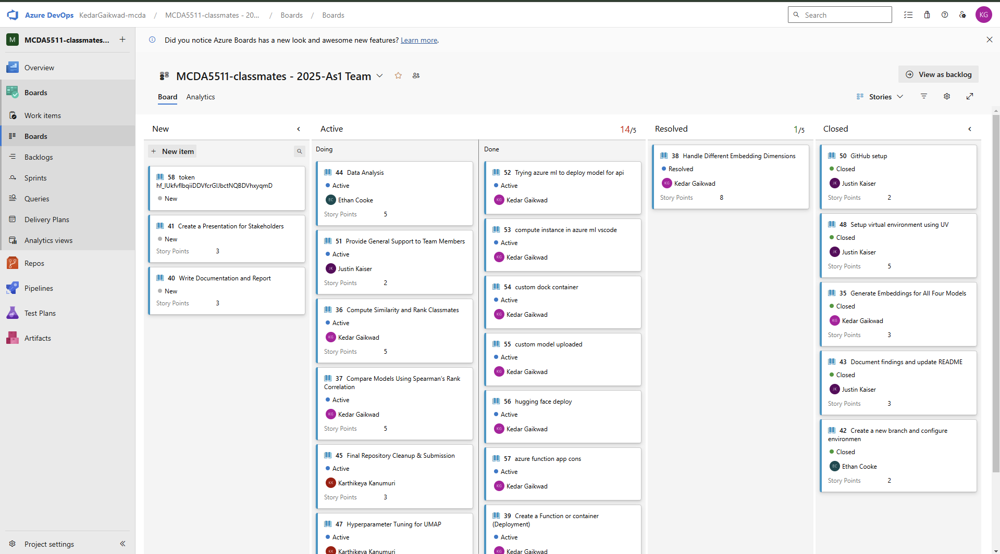
Initially, I considered using **Azure Function App** for the task automation. However, due to its high resource consumption, it wasn't a viable solution. I then explored **Azure ML Studio** by creating a compute instance, but it proved to be too costly and less powerful compared to my local setup. 
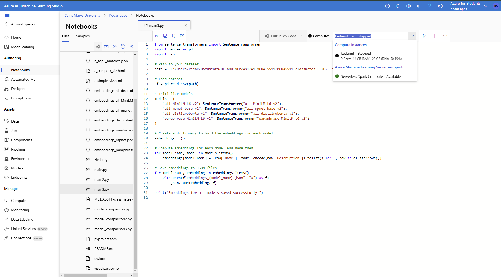  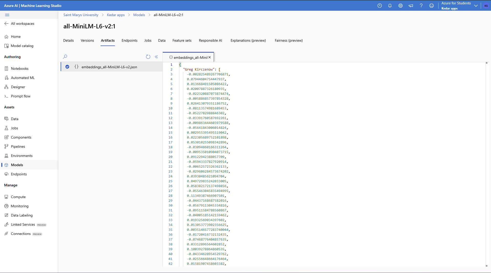 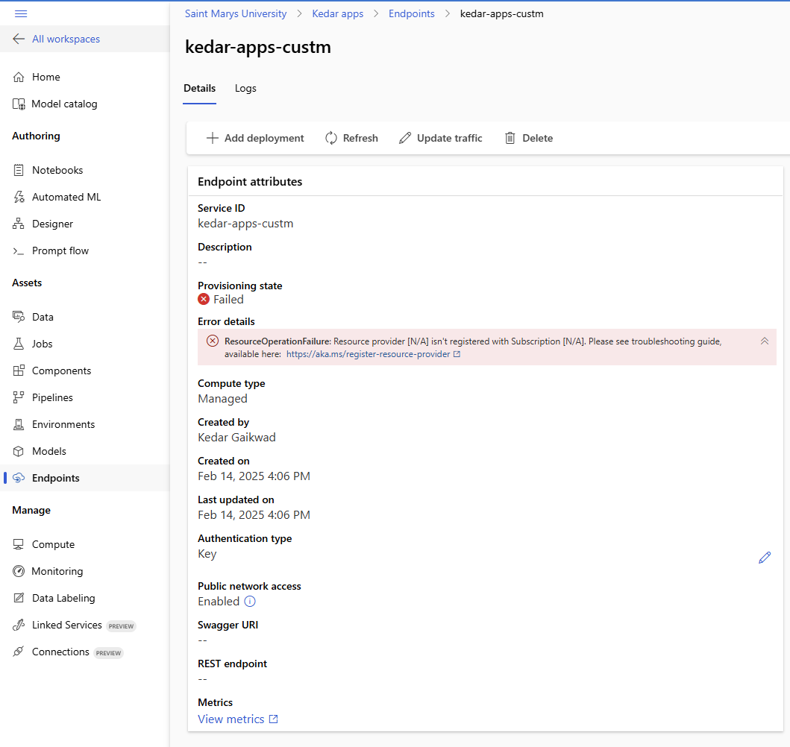  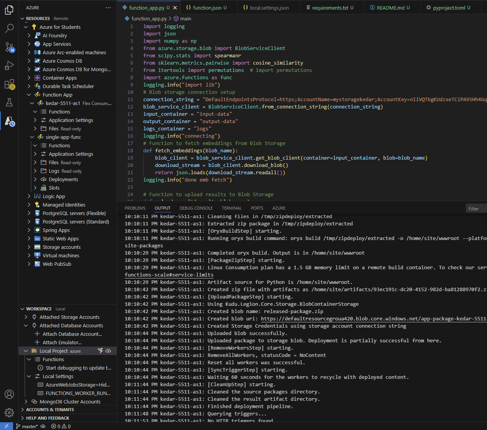
Next, I looked into using **Hugging Face API endpoints**, but I preferred staying within the Azure ecosystem for better integration with Azure Blob Storage, where I was storing input/output logs and embeddings. I created a custom **Docker container** for deployment but encountered permission errors. 
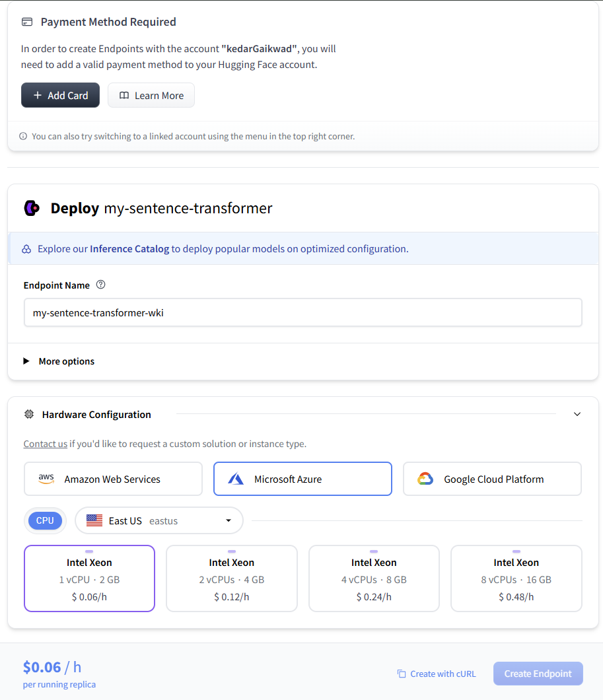 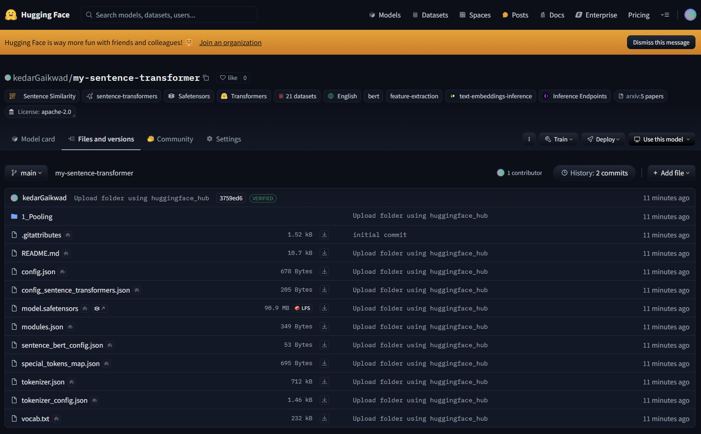 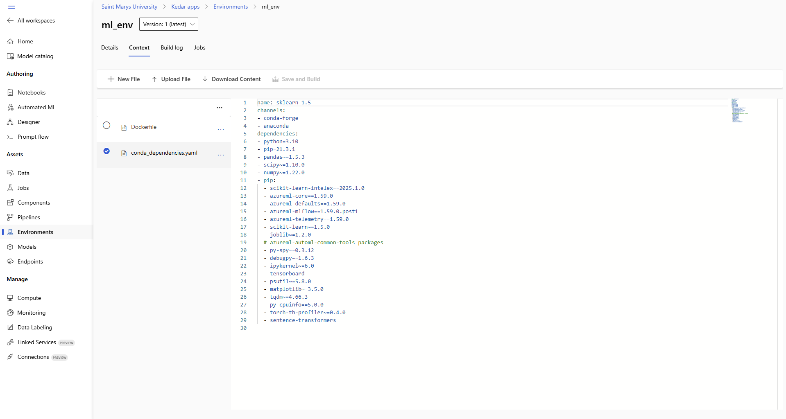 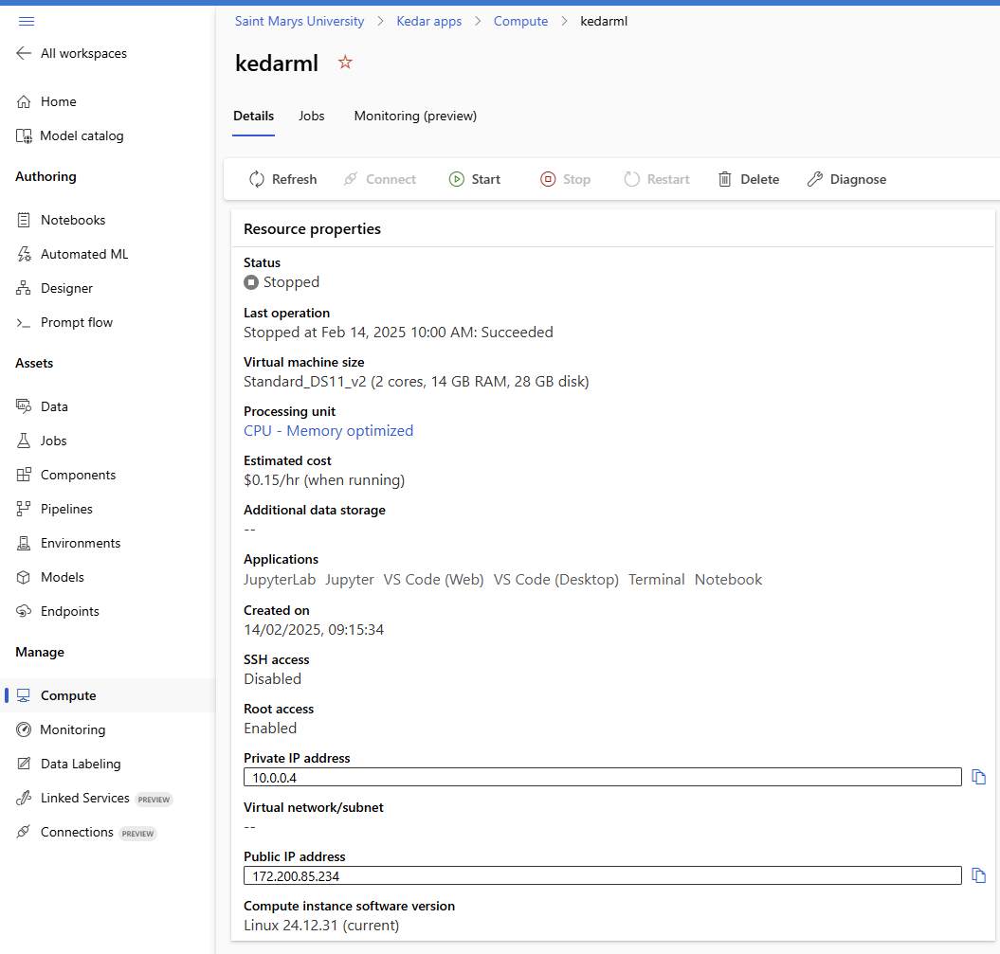
Eventually, I opted to run the embedding generation locally and save the output in **Azure Blob Storage**. To automate the comparison and emailing of the output, I utilized **Azure Functions**, which provided a cost-effective and scalable solution.
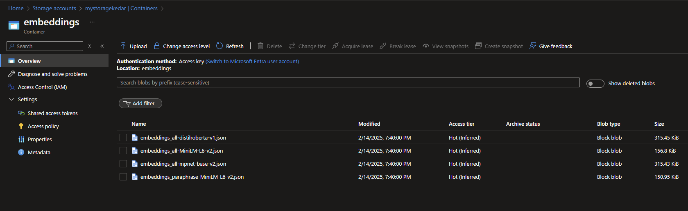 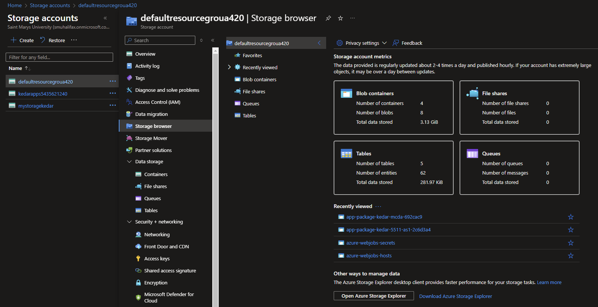
The models I chose for comparison include:
- **"all-MiniLM-L6-v2"**: A lightweight model for general embedding tasks.
- **"all-mpnet-base-v2"**: Known for better performance on longer text.
- **"all-distilroberta-v1"**: A distilled version of RoBERTa, optimized for speed.
- **"paraphrase-MiniLM-L6-v2"**: Specialized in paraphrase detection, which can improve matching accuracy.
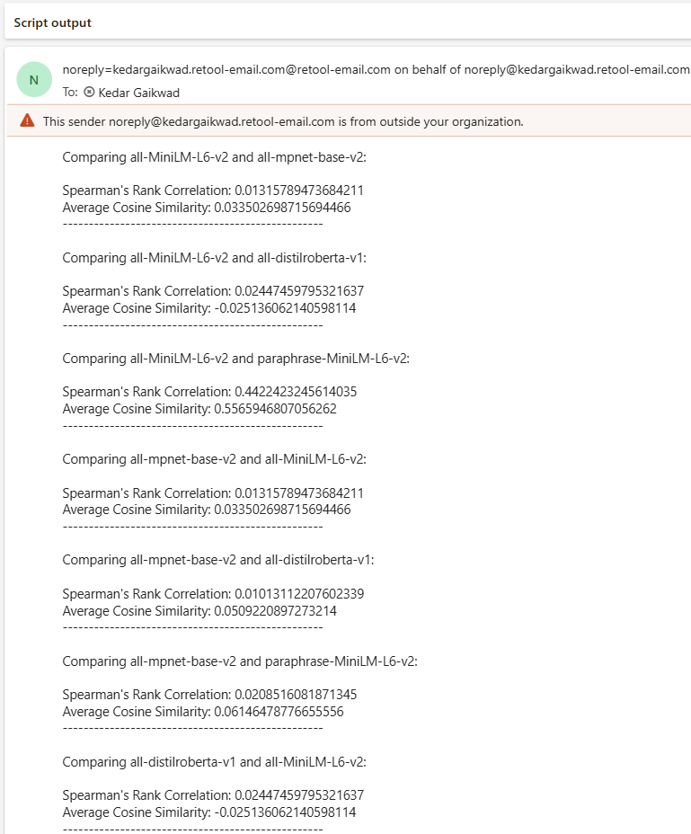 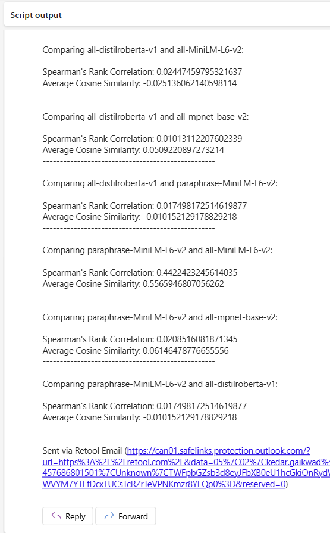
### Embedding Sensitivity Tests

In this experiment, we compared the embeddings generated by four different models: **all-MiniLM-L6-v2**, **all-mpnet-base-v2**, **all-distilroberta-v1**, and **paraphrase-MiniLM-L6-v2**. We used **Spearman's Rank Correlation** to measure how the rank order of classmates, based on similarity, varied across these models.

#### Key Results:
- **all-MiniLM-L6-v2** and **paraphrase-MiniLM-L6-v2** had the highest Spearman’s Rank Correlation (**0.44**), indicating similar rankings of classmates.
- Comparisons with **all-mpnet-base-v2** and **all-distilroberta-v1** showed very low correlations (**≤ 0.02**), meaning these models ranked classmates quite differently.
- The **Average Cosine Similarity** was highest for **all-MiniLM-L6-v2** and **paraphrase-MiniLM-L6-v2** (**0.56**), indicating better alignment in the embeddings produced by these models.

#### Quantitative Insights:
- The rank correlation between different models ranged from very low (0.01) to moderate (0.44), suggesting that model choice significantly impacts the ranking order of classmates.

#### Qualitative Insights:
- While the models ranked classmates in a broadly similar order, the degree of similarity varied. **paraphrase-MiniLM-L6-v2** aligned more closely with **all-MiniLM-L6-v2**, while other combinations showed less consistency in rankings, indicating that each model captures different aspects of similarity.

### Conclusion:
The choice of model can significantly affect the results, especially in terms of how closely the embeddings align in ranking order. This highlights the importance of model selection based on the desired outcome, whether that is computational efficiency, alignment of rankings, or similarity representation.

By leveraging Azure functions and Blob storage, I ensured a production-level workflow that is both efficient and cost-effective.