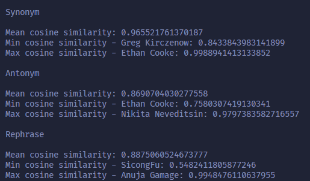

# A1_MCDA_5511
To get the code to run you must

1. Run "uv sync"
2. Select the python "3.10.16" kernal
3. Run .venv\Scripts\Activate
4. Run .venv\Scripts\python.exe -m ensurepip --upgrade
5. Run .venv\Scripts\python.exe -m pip install ipykernel

After completing these steps the code should run fine

If you are on Mac you probably need to switch every '\' to a '/' in the above 
commands.

# What Are Embeddings? (Part_1):
In this code, we have a dataset that contains the names and short descriptions 
of the interests of students and instructors in MCDA 5511. The goal of word 
and sentence embeddings in our context is to transform these textual 
descriptions into numerical representations while embedding semantic meaning. 
This allows the program to analyze the numerical data and determine which 
people have similar interests.

A vector can be thought of as an arrow in 2-dimensional space, where the tail 
of the arrow is at the origin and the arrow itself has both magnitude and 
direction. However, in our case, we don't limit ourselves to just 2 
dimensions. Our dataset uses 384-dimensional vectors, which are impossible to 
visualize but are easy for a computer to process.

In the context of embeddings, a word is represented as a numerical vector. If 
two vectors have a similar direction or are close together in space, their
corresponding words have related meanings. For example, the words "leaf" and 
"tree" would have vectors that are close together because they both relate to 
nature. On the other hand, "leaf" and "lamp" would be farther apart because 
they are unrelated.

Sentence embeddings follow the same principle, but instead of assigning a 
vector to each individual word, an entire sentence is mapped to a single 
vector. For instance, the sentences "I went for a run" and "I enjoy running" 
would have similar vectors because they express related ideas. However, "I 
went for a run" and "My eyes hurt a lot" would have very different vectors 
since they convey unrelated concepts.

# Data Analysis (part_2):
In this section, changes were made to the input data to see their impact on the
corresponding embeddings. This was done by creating 3 new versions of the input data,
and modifying each entry in some common way. These included a file for synonyms, one
for antonyms, and one for rephrasing. 

The modified embeddings were compared using the cosine similarity function.
The smallest change (average cosine similarity of ~0.965) in the embeddings happened 
when a word was chosen from the sentence and replaced with a synonym. 
This makes sense since changing a word with its synonym both retains 
the meaning of the sentence and the structure of the sentence itself.
For instance, the sentence I enjoy cycling is near identical to the sentence I enjoy biking.

Where the embeddings started to become drastically different was with the antonym 
sentences. With this data set, one word was picked out and replaced with an 
antonym. For instance, I love winter became I hate winter. This has a profound 
effect on our embeddings, however not as much as one would think. I believe this 
is because while the opinion on a subject matter may differ the subject stays the 
same. while the previous sentences were opposites they were both talking about
winter.

The last set contained various rephrasings of the given data set. This had a 
similar mean cosine similarity to the antonym set (~0.887), which was initially 
surprising. After considering the results however, adding / changing a 
significant amount of words in the sentence would naturally change the 
embedding to a significant degree.

# Embedding Sensitivity Tests (Part_3)

For this assignment, I approached the task in an organizational-level fashion by adopting Agile methodologies. I created a sprint and a Kanban board to track progress and deliverables. The goal was to compare four models for embedding generation and send the output via email.

Initially, I considered using **Azure Function App** for the task automation. However, due to its high resource consumption, it wasn't a viable solution. I then explored **Azure ML Studio** by creating a compute instance, but it proved to be too costly and less powerful compared to my local setup. 
     
Next, I looked into using **Hugging Face API endpoints**, but I preferred staying within the Azure ecosystem for better integration with Azure Blob Storage, where I was storing input/output logs and embeddings. I created a custom **Docker container** for deployment but encountered permission errors. 
   
Eventually, I opted to run the embedding generation locally and save the output in **Azure Blob Storage**. To automate the comparison and emailing of the output, I utilized **Azure Functions**, which provided a cost-effective and scalable solution.
 
The models I chose for comparison include:
- **"all-MiniLM-L6-v2"**: A lightweight model for general embedding tasks.
- **"all-mpnet-base-v2"**: Known for better performance on longer text.
- **"all-distilroberta-v1"**: A distilled version of RoBERTa, optimized for speed.
- **"paraphrase-MiniLM-L6-v2"**: Specialized in paraphrase detection, which can improve matching accuracy.
 
### Embedding Sensitivity Tests

In this experiment, we compared the embeddings generated by four different models: **all-MiniLM-L6-v2**, **all-mpnet-base-v2**, **all-distilroberta-v1**, and **paraphrase-MiniLM-L6-v2**. We used **Spearman's Rank Correlation** to measure how the rank order of classmates, based on similarity, varied across these models.

#### Key Results:
- **all-MiniLM-L6-v2** and **paraphrase-MiniLM-L6-v2** had the highest Spearman’s Rank Correlation (**0.44**), indicating similar rankings of classmates.
- Comparisons with **all-mpnet-base-v2** and **all-distilroberta-v1** showed very low correlations (**≤ 0.02**), meaning these models ranked classmates quite differently.
- The **Average Cosine Similarity** was highest for **all-MiniLM-L6-v2** and **paraphrase-MiniLM-L6-v2** (**0.56**), indicating better alignment in the embeddings produced by these models.

#### Quantitative Insights:
- The rank correlation between different models ranged from very low (0.01) to moderate (0.44), suggesting that model choice significantly impacts the ranking order of classmates.

#### Qualitative Insights:
- While the models ranked classmates in a broadly similar order, the degree of similarity varied. **paraphrase-MiniLM-L6-v2** aligned more closely with **all-MiniLM-L6-v2**, while other combinations showed less consistency in rankings, indicating that each model captures different aspects of similarity.

### Conclusion:
The choice of model can significantly affect the results, especially in terms of how closely the embeddings align in ranking order. This highlights the importance of model selection based on the desired outcome, whether that is computational efficiency, alignment of rankings, or similarity representation.

By leveraging Azure functions and Blob storage, I ensured a production-level workflow that is both efficient and cost-effective.

### Dimension Reduction Analysis (part_4)

In this assignment, we applied UMAP for dimensionality reduction to visualize patterns in the data. We first ran the algorithm on both the original and tuned models, analyzing how the visualization changed with different random seeds. We observed that using the same seed produced identical plots, while changing the seed altered the layout. However, the relative distances between names remained roughly similar, though this was assessed visually rather than quantitatively. This suggests that while UMAP introduces some randomness, the overall structure is somewhat preserved.  

For the tuned model, we optimized hyperparameters and evaluated the impact on Spearman correlation. Despite achieving a better correlation score, the UMAP visualization did not provide clear conclusions about improvements. We experimented with increasing `n_neighbors` and decreasing `min_distance` to tighten clusters, but these adjustments primarily affect the grouping density rather than correlation.  

Our dataset consists of only 19 records, with each individual contributing just one or two lines of data. Given this limited sample size, any conclusions drawn from UMAP must be interpreted with caution. While the method helps in identifying potential structures, its sensitivity to initialization and small dataset limitations prevent us from making strong claims about model stability based purely on visualization.

